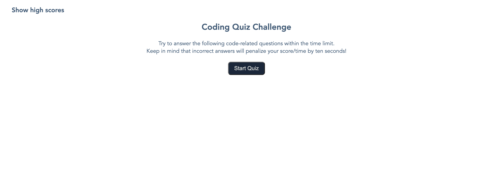

# Code-Quiz
Coding Bootcamp Weekly Challenge 4. This is a Quiz game with questions about coding.  
It is developed using HTML, CSS and JavaScript. 

## About This Repository
This repository contains the working files for the Coding Bootcamp Weekly Challenge 4.  
The objective of this exercise is to feature dynamically updated HTML and CSS powered by JavaScript code. The website basic structure was written in HTML. Javascript is used to hide or show elements on demand. Other elements are created as required during the game. In the end of each round, the user can provide their initials to store in a high-score list. This list is saved on the browsers local storage at the end of the session.

## Website
https://leandromichelena.github.io/Code-Quiz/

## Page Screenshot

## Built With
* HTML
* CSS
* javascript

## Support
If you find any bugs or have any questions, please contact me on Github.

## Authors and Acknowledgment
HTML, CSS, and javascript created by Leandro Michelena.

## License
MIT License
